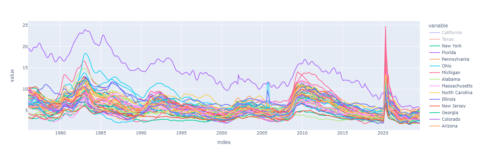

# 📊 Análisis de la Economía Estadounidense a través de la APIs

Este proyecto tiene como objetivo realizar un análisis del estado de la economía estadounidense utilizando datos públicos proporcionados por la Reserva Federal a través de su **API FRED (Federal Reserve Economic Data)**. Utilizando diversas herramientas de análisis de datos, visualización y manipulación, este proyecto ayuda a generar visualizaciones y métricas clave para el seguimiento de la economía.

## 🚀 Características del Proyecto

- 🔍 **Acceso a datos económicos en tiempo real** a través de la **API FRED**, directamente desde la Reserva Federal.
- 🛠 **Manipulación y análisis de grandes volúmenes de datos** con **Pandas** y **NumPy**.
- 📈 **Visualizaciones interactivas y estáticas** que facilitan el análisis de tendencias económicas utilizando **Matplotlib** y **Plotly**.
- 📊 **Monitoreo de indicadores económicos clave** como el Producto Interno Bruto (PIB), la inflación, las tasas de desempleo, entre otros.

## 🛠 Tecnologías Utilizadas

## 🛠 Tecnologías Utilizadas

- **Python**: Lenguaje base para el desarrollo del proyecto.
- **FRED API**: 🌐 **Fuente principal de datos económicos** proporcionada por la Reserva Federal de EE. UU.
- **Pandas**: Para la manipulación avanzada de datos tabulares.
- **NumPy**: Para operaciones matemáticas y de álgebra lineal.
- **Matplotlib**: Para crear visualizaciones estáticas de los datos.
- **Plotly Express**: Para gráficos interactivos y dinámicos.
- **Chart Studio**: Para alojar, compartir, y obtener gráficos interactivos generados con **Plotly** en la nube, facilitando la colaboración y presentación de los resultados de manera accesible en línea.

# 🛠 📊  Haga clic en el enlace de la imagen para utilizar el gráfico interactivo.

** Es importante destacar que, debido a las limitaciones de la capacidad de la API, solo se pueden mostrar cuatro estados. No obstante, al ejecutar el archivo del notebook, es posible acceder de manera interactiva a los datos correspondientes a los demás estados.

   
